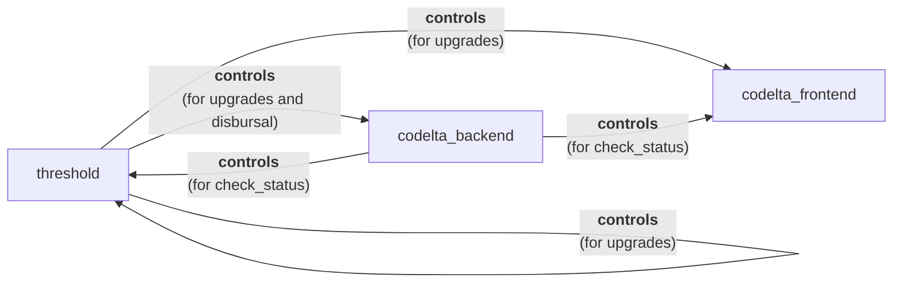

# CO.DELTA △
Built on the [Internet Computer ∞](https://internetcomputer.org/) 

We're a verifiably decentralised **co**llective who review IC **delta**s (changes applied by [NNS proposals](https://dashboard.internetcomputer.org/governance?s=100&topic=TOPIC_API_BOUNDARY_NODE_MANAGEMENT|TOPIC_APPLICATION_CANISTER_MANAGEMENT|TOPIC_GOVERNANCE|TOPIC_IC_OS_VERSION_DEPLOYMENT|TOPIC_IC_OS_VERSION_ELECTION|TOPIC_KYC|TOPIC_NETWORK_ECONOMICS|TOPIC_NODE_ADMIN|TOPIC_NODE_PROVIDER_REWARDS|TOPIC_PARTICIPANT_MANAGEMENT|TOPIC_PROTOCOL_CANISTER_MANAGEMENT|TOPIC_SERVICE_NERVOUS_SYSTEM_MANAGEMENT|TOPIC_SNS_AND_COMMUNITY_FUND|TOPIC_SUBNET_MANAGEMENT|TOPIC_SUBNET_RENTAL|TOPIC_SYSTEM_CANISTER_MANAGEMENT)). We follow a common **code**:

- **L**ook: We observe the details and context of NNS proposals
- **T**est: We test and verify the claims made by those proposals
- **A**utomate: We automate as much as possible by building increasingly sophisticated tools that streamline and strengthen the reviewal process.

Every vote cast by **CO.DELTA** is the result of consensus among diligent, skilled and experienced team members acting independently. The [CO.DELTA neuron](https://dashboard.internetcomputer.org/neuron/33138099823745946) follows the vote of [D-QUORUM](https://dashboard.internetcomputer.org/neuron/4713806069430754115) on NNS topics that the CO.DELTA team does not handle directly. You can therefore follow CO.DELTA on all NNS topics and rely on a high quality vote.

-------

# Canisters

Canisters are Internet Computer smart contracts ([more info](https://internetcomputer.org/docs/building-apps/essentials/canisters)). CO.DELTA is composed of 3:

1. **codelta_frontend**: [wtjj7-cyaaa-aaaar-qaozq-cai](https://dashboard.internetcomputer.org/canister/wtjj7-cyaaa-aaaar-qaozq-cai)
2. **codelta_backend**: [qkgir-uyaaa-aaaar-qaonq-cai](https://dashboard.internetcomputer.org/canister/qkgir-uyaaa-aaaar-qaonq-cai)
3. **threshold** [6g7za-ziaaa-aaaar-qaqja-cai](https://dashboard.internetcomputer.org/canister/6g7za-ziaaa-aaaar-qaqja-cai) ([separate repo](https://github.com/aodl/threshold))

None of these canisters are controlled unilaterally by any person. They're decentralised, requiring team member consensus to manage and upgrade. More info below.

## [codelta_frontend](https://dashboard.internetcomputer.org/canister/wtjj7-cyaaa-aaaar-qaozq-cai)

https://wtjj7-cyaaa-aaaar-qaozq-cai.icp0.io/

A standard static asset canister, providing an on-chain point of reference that describes what CO.DELTA is.

The controllers of this canister are the **codelta_backend** canister and **threshold** canister described below.

## [codelta_backend](https://dashboard.internetcomputer.org/canister/qkgir-uyaaa-aaaar-qaonq-cai)

https://a4gq6-oaaaa-aaaab-qaa4q-cai.raw.icp0.io/?id=qkgir-uyaaa-aaaar-qaonq-cai

The codelta_backend canister (principal qkgir-uyaaa-aaaar-qaonq-cai) is the verifiable controller of the [CO.DELTA known neuron](https://dashboard.internetcomputer.org/neuron/33138099823745946). This can be verified by querying the [NNS Governance Canister](https://dashboard.internetcomputer.org/canister/rrkah-fqaaa-aaaaa-aaaaq-cai)'s `list_neurons` method (specify `include_public_neurons_in_full_neurons` and the CO.DELTA neuron ID: 33138099823745946).

#### check_status
Given that no individual has control over the frontend and backend canisters, their status information needs exposing by other means (this is important for managing cycles balance etc.). For this reason the codelta_backend canister exposes a `check_status` method, callable by any member of the CO.DELTA team. It accepts a canister principal as an argument, and can be used to display the status information of either the frontend, backend, or threshold canister. This is why the backend canister is set as one of the controllers of the frontend canister and the threshold canister (so that it can access this information).

#### check_balance
Similar to `check_status` (above) but this method displays the ICP balance held in the canisters default account. This is the source of ICP that can be distributed to CO.DELTA members (to reward them for their NNS reviews and contributing to the CO.DELTA vote). As with `check_status`, `check_balance` is callable by any member of the CO.DELTA team. It does not accept any arguments and is only intended for checking the canisters own balance.

#### distribute_icp
The primary purpose of the codelta_backend canister is to act as a decentralised entity that can accept voting rewards (ICP that can be held by the canister's default account). A `distribute_icp` method is provided, but can be called by no other principal than the canister controller. Given that the backend canister's controller is the threshold canister, distributing this ICP therefore requires a `distribute_icp` proposal and CO.DELTA member consensus. This setup is intended to faciliate equal shares of the rewards periodically distributed to each member. This is to incentivise their NNS governance participation via the CO.DELTA neuron. See the 'Neuron Configuration' section below. Also see the [Grants for Voting Neurons](https://forum.dfinity.org/t/grants-for-voting-neurons/32721) initiative for context.

**Both the frontend and backend canisters are controlled by the threshold canister**, which is what provides the decentralisation guarantee (that no individual member of CO.DELTA can exert unilateral control over the canisters, its funds, nor the neuron).

## threshold

This canister is set as the exclusive controller of the **codelta_backend** canister. Both the **threshold** canister and the **codelta_backend** canister are the controllers of the **codelta_frontend** canister. The **threshold canister** is also set as it's own controller (facilitating self-upgrade proposals), in addition to being controlled by the **codelta_backend**. The reasoning for this is described above (see check_status).

The threshold canister is what allows the other canisters to be managed in a decentralised manner, requiring a vote from team members in order to upgrade the canister or disburse ICP.

Although self-upgrades are supported, if an upgrade of the threshold canister is ever needed, the plan would be to initialise a second threshold canister with the same configuration (as a fallback). Threshold canister A would then need to assign joint control to threshold canister B (an operation that would require a proposal and consensus). This would act as a safety measure, allowing recovery from botched threshold canister upgrades (just in case).

# Settings

The majority of canister settings are using the default values. There are a few that have been explicitly set, described below.

- `log-visibility=public`
  - This has been set on all 3 canisters, allowing anyone to query the logs rather than just controllers, e.g. `dfx canister logs qkgir-uyaaa-aaaar-qaonq-cai --network=ic`
- `freezing-threshold`
  - codelta_backend: `freezing-threshold=15552000` (180 days)
    - A long period of time to ensure the canister is never deleted. The canister does not need to be running continously. If it ever freezes it will need unfreezing before triggering the next dispursal. This acts as a forcing function to check and top up the cycles balance of the canister.  
  - codelta_fondend: `freezing-threshold=15552000` ( 90 days)
    - Half the freezing threshold of the backend canister. It should never hit this threshold, and should be topped up as needed whenever the backend canister is topped up. This ensures that the frontend is always up and available.
  - threshold: `freezing-threshold=15552000` (180 days)
    - Same as the backend canister, for the same reasons. One of the reasons that disbural has been designed to require a proposal and voting is that this ensures regular usage of the threshold canister (avoiding long periods of time where it goes unused, and the possibility that it freezes without being noticed, and then eventually gets deleted by the protocol after the freezing threshold elapses)
- `controllers`
  - codelta_backend: `6g7za-ziaaa-aaaar-qaqja-cai`
  - codelta_frontend: `6g7za-ziaaa-aaaar-qaqja-cai`, `qkgir-uyaaa-aaaar-qaonq-cai`
  - threshold: `6g7za-ziaaa-aaaar-qaqja-cai`, `qkgir-uyaaa-aaaar-qaonq-cai`

# Neuron Configuration

The [CO.DELTA known neuron](https://dashboard.internetcomputer.org/neuron/33138099823745946) is configured to follow members of the CO.DELTA team on the NNS topic(s) that they cover. For any NNS topics that are not covered directly by members of CO.DELTA, the CO.DELTA neuron follows the vote of [D-QUORUM](https://dashboard.internetcomputer.org/neuron/4713806069430754115). This means CO.DELTA can be followed on all NNS topics and deliver a high quality, well-informed decentralised vote for followers.

The current neuron configuration can be established by querying the [NNS Governance Canister](https://dashboard.internetcomputer.org/canister/rrkah-fqaaa-aaaaa-aaaaq-cai). Use the `list_neurons` method. Specify `include_public_neurons_in_full_neurons` and provide the CO.DELTA neuron ID: 33138099823745946.

An internal topic that the members of CO.DELTA cover is Neuron Management. This allows members of the CO.DELTA team to manage the CO.DELTA known neuron via NNS proposals (here are some examples: [135418](https://dashboard.internetcomputer.org/proposal/135418), [135438](https://dashboard.internetcomputer.org/proposal/135438), [135585](https://dashboard.internetcomputer.org/proposal/135585)). This avoids having to re-invent the wheel with the codelta_backend canister regarding neuron management.

# Team

Current CO.DELTA members are listed on the frontend -> https://wtjj7-cyaaa-aaaar-qaozq-cai.icp0.io/

